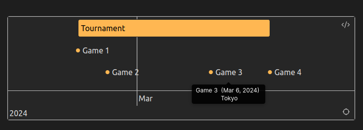
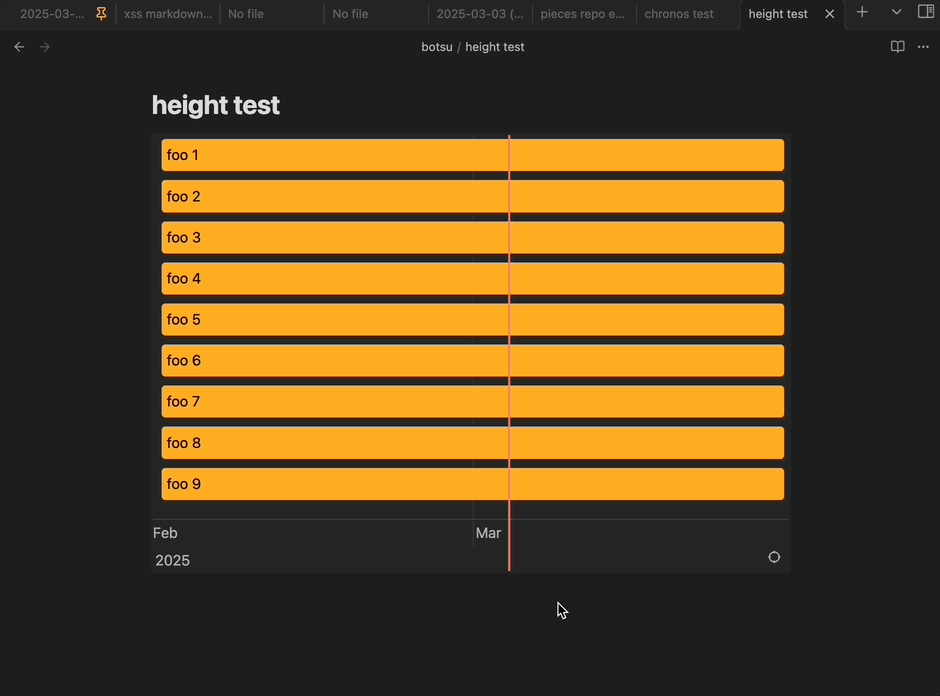
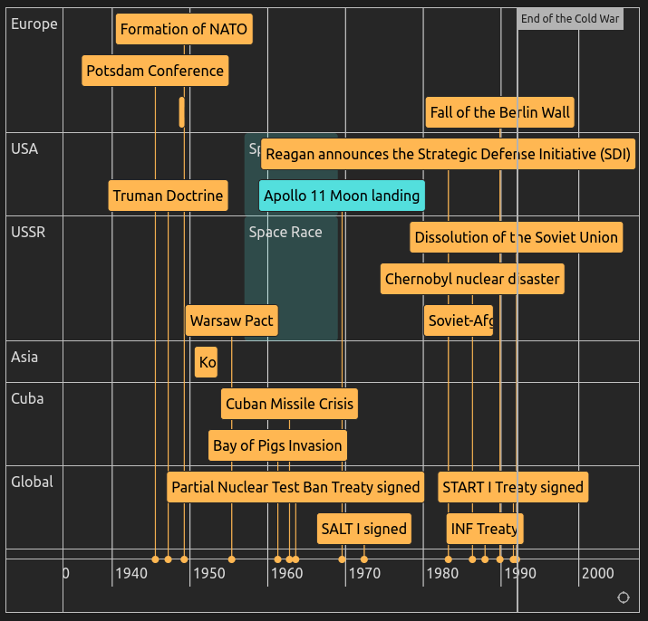
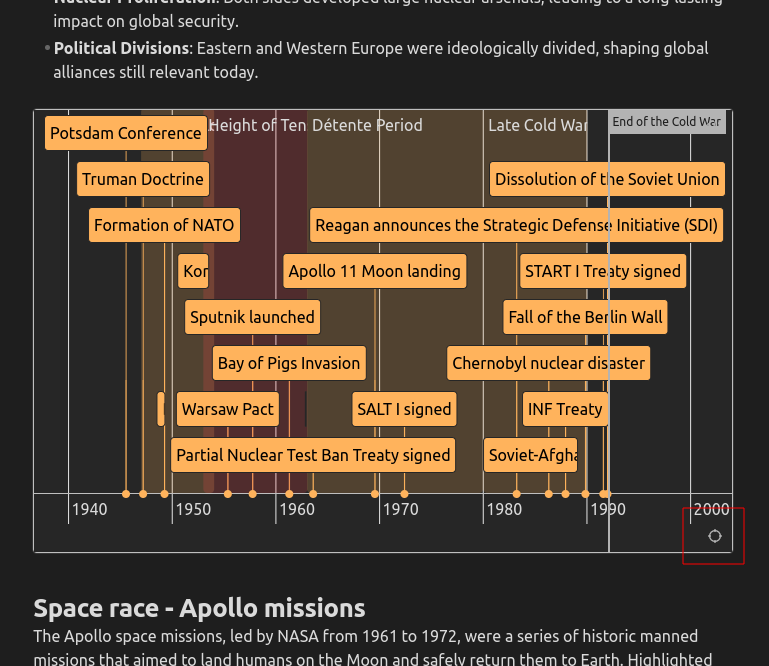

# Chronos Timeline Markdown

Render interactive timelines from simple Markdown. Make time make sense.

Powered by [vis.js](https://visjs.org/)

```
- [2020] A year
- [2020-02] A month
- [2020-02-28] A day
- [2020-02-28T12] An hour
- [2020-02-28T12:30] A minute
- [2020-02-28T12:30:09] A second
```


## Table of Contents

- [Syntax Overview](#syntax-overview)
  - [A note on dates](#a-note-on-dates)
    - [Date ranges](#date-ranges)
    - [BCE time](#bce-time)
    - [Limitations](#limitations)
- [Events `-`](#events--)
  - [Events with a single date](#events-with-a-single-date)
  - [Events with start and end dates](#events-with-start-and-end-dates)
  - [Events with descriptions](#events-with-descriptions)
- [Periods `@`](#periods-)
- [Points `*`](#points-)
- [Markers `=`](#markers-)
- [Comments `#`](#comments-)
- [Flags `>`](#flags-)
  - [NOTODAY flag](#notoday-flag)
  - [HEIGHT flag](#height-flag)
  - [ORDERBY flag](#orderby-flag)
  - [DEFAULTVIEW flag](#defaultview-flag)
- [Modifiers](#modifiers)
  - [Colors `#color`](#colors-color)
  - [Groups `{}`](#groups-)
- [Advanced example](#advanced-example)
- [Actions](#actions)
  - [Refit](#refit)

# Syntax Overview

Chronos parses Markdown in `chronos` code blocks into objects on a timeline

```sh
<chronos timeline items here>
```

The first character of each line in your `chronos` block determines the item type:

- [Events](#events--) (`-`)
- [Periods](#periods-) (`@`)
- [Points](#points-) (`*`)
- [Markers](#markers-) (`=`)
- [Comments](#comments-) (`#`)
- [Flags](#flags-) (`>`)

Certain items can be modified with **colors** and **group** membership (see [Modifiers](#modifiers))

## A note on dates

Chronos can visualize dates from the year down to the second level, using the syntax `YYYY-MM-DDThh:mm:ss`.

The only required component of a date is the year (`YYYY`). Beyond that, you can specify additional time granularity as needed for your use case.

If not explicitly provided:

- The month and day default to `01` (January and the 1st)
- The hour, minute, and second default to `00` (top of the hour or minute)

**Hours** use 24-hr military time. So 3am is `03`, while 3pm is `15`

**Examples**

```
- [2020] A year
- [2020-02] A month
- [2020-02-28] A day
- [2020-02-28T12] An hour
- [2020-02-28T12:30] A minute
- [2020-02-28T12:30:09] A second
```


### Date ranges

Date ranges are separated by a tilde `~`, **NOT a hyphen**! Look out :)

The start and end date must be in chronological order.

```sh
- [2020~2024]
- [2024-02-28~2024-05-11]
- [2024-02-28T05:30~2024-02-28T08:30]
```

### BCE time

You can signify BCE times with the negative symbol (-)

```sh
- [-10000]    <--- 10000 BCE
- [-550~-20]  <--- 550 ~ 20 BCE
- [-550~550]  <--- 550 BCE ~ 550 CE
```

### Limitations

- Dates **must be between year 271,821 BCE and 275,761 CE**, due to how Dates work in JavaScript... don't think too far ahead.

## Events `-`

Events can include a single date or a date range.

### Events with a single date

**Syntax**

```sh
- [Date] Event Name
```

Only `[Date]` is required. If no `Event Name` is provided, the event title will default to the date or date range.

**Example**

```sh
- [1879-03-14] Einstein born
```


### Events with start and end dates

A date range is represented with a tilde (`~`) between the start and end dates.

**Syntax**

```sh
- [Date~Date] Event Name
```

**Example**

```sh
- [1991~2001] Time I believed in Santa
```


### Events with descriptions

You can add additional information to an event by adding a pipe `|` after the Event name. This text will appear in a popup when you hover over an event.

**Example**

```sh
- [1991~2001] Time I believed in Santa | ended when my brother tried to videotape Santa with a hidden camera
```


## Periods `@`

Periods are spans of time displayed with a semi-transparent background. **Periods must be a range with a start and end date**. `Period Name` is optional

```
@ [Date~Date] Period Name
```

**Example**

```sh
@ [-300~250] #red Yayoi Period
- [-100] Introduction of rice cultivation
- [-57] Japan’s first recorded contact with China

@ [250~538] Kofun Period
- [250] Construction of keyhole-shaped kofun burial mounds begins
- [369] Yamato state sends envoys to Korea
```


## Points `*`

Points are ideal for marking a point in time. You can optionally add a `Description` that will appear on hover.

```
* [Date] Point Name | Description
```

```sh
- [2024-02-26~2024-03-10] Tournament
* [2024-02-26] Game 1 | Austin
* [2024-02-28] Game 2 | Los Angeles
* [2024-03-06] Game 3 | Tokyo
* [2024-03-10] Game 4 | Jakarta
```



## Markers `=`

Markers can be used to highlight a key milestone in time. **Markers must be a single date**. `Marker Name` is optional

```
= [Date] Marker Name
```

**Example**

```
= [1440] Invention of the Gutenberg Press

- [1455] Gutenberg Bible Printed
@ [1501~1600] The Spread of Printing
- [1517] Martin Luther's 95 Theses
```


## Comments `#`

Chronos will ignore any line that starts with `#`. You can use this to write comments to yourself or block out items.

**Example**

```sh
# this line is a comment, it will be ignored by chronos

- [1789~1799] French Revolution
- [1791~1804] Haitian Revolution
- [1776] American Declaration of Independence

# the event below will not render, since it has been commented out
# - [1939~1945] World War II
```


## Flags `>`

You can add flags to your timeline by using the `>` symbol. Flags are parsed on separate lines, and are case insenstive. You can use multiple flags.

**Example**
The timeline below uses the `NOTODAY` and `ORDERBY` flags, to hide the current time marker and to order the stack of overlapping items by start date.

```sh
> NOTODAY
> ORDERBY start

- [2022~2024] foo
- [2020~2024] bar
```

### NOTODAY flag

Hide the vertical bar that marks today's time

```
> NOTODAY
```

(without flag)

```sh
- [2025-02-02~2025-03-28] foo
```


(with flag)

```sh
> NOTODAY
- [2025-02-02~2025-03-28] foo
```


### HEIGHT flag

Set a fixed height for a given timeline (in pixels).

If needed, you can vertically scroll your timleline by clicking and dragging up or down

```
> HEIGHT <number of pixels>
```

```sh
> HEIGHT 300

- [2025-02-02~2025-03-28] foo 1
- [2025-02-02~2025-03-28] foo 2
- [2025-02-02~2025-03-28] foo 3
- [2025-02-02~2025-03-28] foo 4
- [2025-02-02~2025-03-28] foo 5
- [2025-02-02~2025-03-28] foo 6
- [2025-02-02~2025-03-28] foo 7
- [2025-02-02~2025-03-28] foo 8
- [2025-02-02~2025-03-28] foo 9
```



### ORDERBY flag

By default, Chronos ordering is set by the stacking of the elements in the timeline.

The `ORDERBY` flag can be used to specify an ordering

> [!WARNING]
> Ordering can make the timeline laggy when there are many items. Use with precaution

```
> ORDERBY start|-content
```

- You can use any of these fields: `start` | `end` | `content` | `color` | `description`.
  - _Start date_ | _end date_ | _item label content_ | _color_ | _item description_
- You can stack them by joining them with a pipe `|` to add another sorting level.
- You can prepend a dash `-` to any of the fields to order in descending order on this field.

#### Example

**Order by start date**

```sh
> ORDERBY start

- [2026~2028] Event D
- [2024~2028] Event B
- [2025~2030] #red Event C
- [2020~2030] #red  Event A
```


**Order by color and start**

```sh
> ORDERBY color|start

- [2026~2028] Event D
- [2024~2028] Event B
- [2025~2030] #red Event C
- [2020~2030] #red Event A
```


### DEFAULTVIEW flag

Use the `> DEFAULTVIEW start|end` flag to specify default start and end dates for your timeline's initial load.

You can use YYYY-MM-DD timestamps for the start and end date, with the minimum requirement being YYYY.

```sh
> DEFAULTVIEW -3000|3000

- [2024] AGI
```


## Modifiers

Modifiers **#color** and **{Group}** can be added to **Events** (`-`) and **Periods** (`@`) with the following optional syntax.

```
- [Date~Date] #color {Group Name} Name | Description
```

The modifiers must go in this order: between `Dates` and `Name`, with color first if both color and group are used.

### Colors `#color`

By default, Chronos matches your Obsidian theme color.

To give items a specific color, you can include an available color after the date: `#red` | `#orange` | `#yellow` | `#green` | `#blue` | `purple` | `#pink` | `#cyan`

**Example**

```sh
- [2001~2009] #red Bush
- [2009~2017] #blue Obama
- [2017~2021] #red Trump
- [2021~2025] #blue Biden

@ [2020-03-11~2023-05-11] #pink COVID19

```


### Groups `{}`

**Events** and **Periods** can be grouped into "swimlanes" by specifying a `Group Name` in curly brackets `{}` after the `Date` (or `Color`, if present). Group names are case sensitive and may contain spaces.

The order of items does not matter, but the example below lumps items together by group for human legibility.

**Example**

```sh
@ [1892-10-08~1941-08-31]{Marina Tsvetaeva} 1892-1941
- [1916] {Marina Tsvetaeva} "Подруга"
- [1928] {Marina Tsvetaeva}  "Поэма концов"
- [1941] {Marina Tsvetaeva} "Записки о поэзии"

@[1899-08-24~1986-06-14]{Jorge Luis Borges} 1899-1986
- [1944] {Jorge Luis Borges} "Ficciones"
- [1949] {Jorge Luis Borges} "El Aleph"
- [1962] {Jorge Luis Borges} "Labyrinths"
```


## Advanced example

This example combines **Events**, **Periods**, **Markers**, **Comments**, **Descriptions**, **Groups** and **Colors**

```sh
- [1945-07-17] {Europe} Potsdam Conference | where post-WWII Europe is divided
- [1947-03-12] {USA} Truman Doctrine | committing the U.S. to containing communism
- [1948-06-24~1949-05-12] {Europe} Berlin Blockade | and Airlift in response to Soviet actions in Berlin
- [1949-04-04] {Europe} Formation of NATO

# Early Cold War

@ [1957~1969] #cyan {USSR} Space Race
@ [1957~1969] #cyan {USA} Space Race
- [1950-06-25~1953-07-27] {Asia} Korean War | between North and South Korea
- [1955-05-14] {USSR} Warsaw Pact | in response to NATO
- [1957-10-04] #cyan {USSR} Sputnik launched | initiating the Space Race
- [1961-04-17] {Cuba} Bay of Pigs Invasion | in Cuba

# Height of Tensions

- [1962-10-16] {Cuba} Cuban Missile Crisis | a peak confrontation between the U.S. and USSR
- [1963-08-05] {Global} Partial Nuclear Test Ban Treaty signed
- [1969-07-20] #cyan {USA} Apollo 11 Moon landing | U.S. wins the Space Race
- [1972-05-26] {Global} SALT I signed | first Strategic Arms Limitation Treaty

# Détente Period

- [1979-12-24~1989-02-15] {USSR} Soviet-Afghan War | straining Soviet resources
- [1983-03-23] {USA} Reagan announces the Strategic Defense Initiative (SDI)
- [1986-04-26] {USSR} Chernobyl nuclear disaster
- [1987-12-08] {Global} INF Treaty | signed, eliminating intermediate-range nuclear missiles

# Late Cold War

- [1989-11-09] {Europe} Fall of the Berlin Wall | symbolizing the end of Cold War tensions
- [1991-07-31] {Global} START I Treaty signed | further arms reduction
- [1991-12-26] {USSR} Dissolution of the Soviet Union | officially ending the Cold War

= [1991-12-26] End of the Cold War
```



# Actions

## Refit

Click the **Refit** button (crosshairs icon) in the lower-right corner to adjust all items to fit within the view window.


